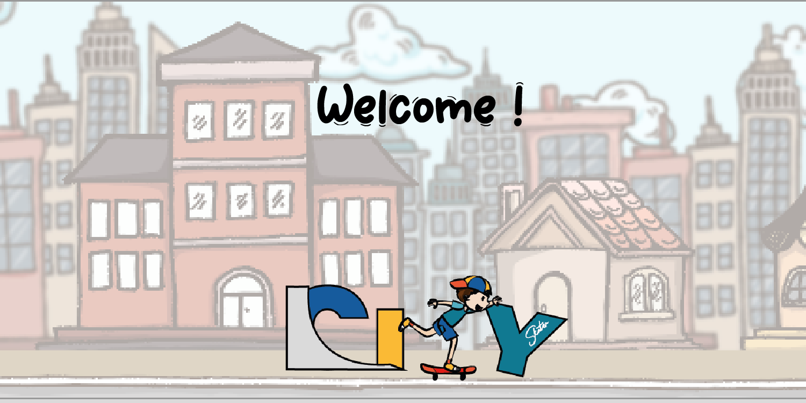

# Projet GitHub : Jeu JavaScript

Ce projet GitHub est une collaboration entre plusieurs contributeurs pour créer un jeu en JavaScript. Le développement est réalisé par les développeurs suivants :

- @ArtChard
- @greg0788
- @Ulfhednar12
- @Xoop8

Les designers qui participent à ce projet sont :

- Jules Gambier
- Saada Kebiri
- Issa Mzwakali

## Description du projet

Ce projet consiste en la création d'un jeu en JavaScript en seulement deux jours. Le jeu vise à offrir une expérience divertissante et interactive aux utilisateurs. 

## Logo

## Vidéo promotionnelle

<video controls>
    <source src="VideoPromotionelleGameJam.mp4" type="video/mp4">
    Votre navigateur ne prend pas en charge la balise vidéo.
</video>

Pour plus de détails et de contributions, veuillez vous référer au dépôt GitHub du projet.
